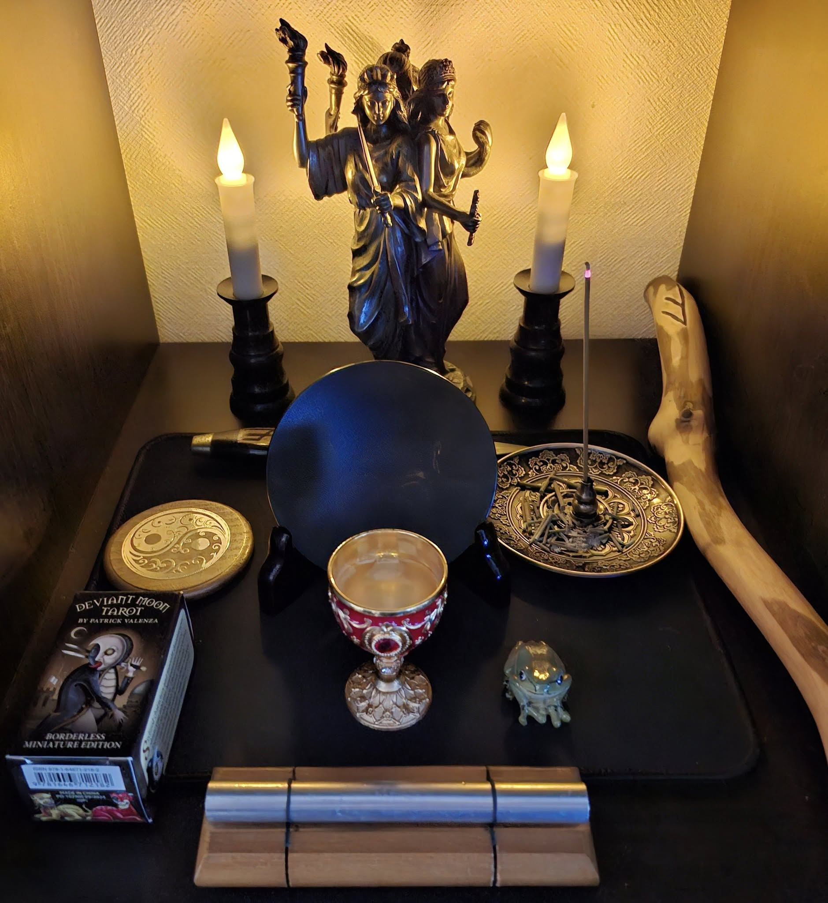

# Hekate チャント・ガイドブック（日常ワーク用）

このガイドブックは、儀式空間を必要としない日常の中で、
女神ヘカテと繋がるための簡潔なチャント（詠唱）を紹介するものです。

## 構造と目的

各チャントは以下のような構造を基本としています：

- 開始：**IO HEKATE**（女神への呼びかけ）
- 本文：祈願・導き・守護・感謝など（3行）
- 終了：**IAOM**（エネルギーを封印し、儀式を閉じる神聖音）

この構造により、朝・昼・夜・睡眠前などの時間帯ごとに
簡潔な儀式を構成できます。

---

## 読み方（カタカナ発音）一覧

| 表記             | カタカナ読み       | 意味                         |
|------------------|--------------------|------------------------------|
| IO HEKATE        | イオ・ヘカテー     | ヘカテへの感嘆呼びかけ         |
| IAOM             | イー・アー・オーム | 神聖な封印音（Jason Miller型）|
| TRIMORPHIS       | トリモルフィス     | 三相の女神                   |
| CHTHONIA         | クトニア           | 冥界の女神                   |
| PHOSPHOROS       | フォスフォロス     | 光をもたらす者               |
| KLEIDOKHOUS      | クレイドコウス     | 鍵を持つ者                   |
| PROPYLAIA        | プロピュライア     | 門の守護者                   |

---

## 🌄 朝のチャント（Awakening）
```
IO HEKATE  
PHOSPHOROS — bring the dawn.  
TRIMORPHIS — walk beside me this day.  
KLEIDOKHOUS — unseal the path with the sacred key. 
IAOM

## 補足
つまり声に出すのは：  
イオ・ヘカテー。フォスフォロス。トリモルフィス。クレイドコウス。イー・アー・オーム。  

頭の中では：  
（光をもたらす者よ、夜を越えて私とともに歩め。鍵を持ち、道を開け──）  
```

## 🌞 昼のチャント（Protection）
```
IO HEKATE  
PROPYLAIA – stand guard at the crossroads.  
CHTHONIA — anchor me in stillness.  
KLEIDOKHOUS — seal the gate behind me.  
IAOM
```

## 🌙 夜のチャント（Thanks & Release）
```
IO HEKATE  
CHTHONIA – bringer of shadows, I thank you.  
TRIMORPHIS — wrap me in silence and fire.  
PROPYLAIA — I return to the center.  
IAOM
```

## 🌌 眠る前のチャント（Sleep Protection）
```
IO HEKATE  
CHTHONIA — guard my sleep from shadow.  
TRIMORPHIS — guide me through the dreamways.  
PROPYLAIA — lock the gates 'til dawn.  
IAOM
```

## 🛡️ 保護と浄化のチャント（Anytime）
```
IO HEKATE  
CHTHONIA – shield me from what I cannot see.  
KLEIDOKHOUS – root me deep in earth.  
PROPYLAIA — seal my circle.  
IAOM
```

---

## メモ
- カタカナは儀式テキストには含めず、**音読記憶・習熟のための補助**として活用してください。
- 各チャントは3行ですが、感覚に合わせて静かに間をとるとより効果的です。
- 外出前、寝る前、移動中など、**日常の“隙間”に魔術を差し込むためのプロトコル**です。



---

© 2025 知られざる呪術師（Le Sorcier Inconnu）  
本ドキュメントは [Creative Commons BY-SA 4.0](https://creativecommons.org/licenses/by-sa/4.0/deed.ja) に基づき公開されています。
